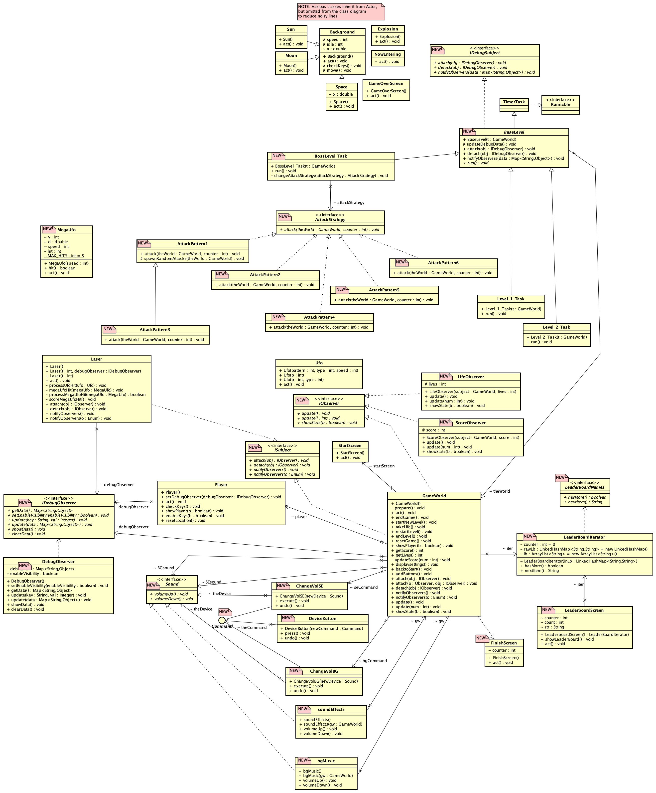

# Team Pied Piper Project

## Team Members

* Roger Kuo
* John Monsod
* Siddhant Satish Parma
* Faizali Mulla
* Hashmitha Katta

## Project Topic
- Customized Space Shooter Arcade Game based on Greenfoot starter code [P-TYPE](https://www.greenfoot.org/scenarios/13388).

## Summary of Project

Our project involved taking an existing Greenfoot game called P-TYPE and customizing it with several
enhancements. Our team coordinated on a regular basis to tackle a set of User Stories that we converted
into tangible tasks, and designated each of us to work on concurrently.

This work required us to take the original source code as a starting point, identify several areas where changes
needed to be made, and applied code changes as appropriate. We followed a branch+merge strategy, where each of
us worked on our respective branch of changes, and submitted for a Pull Request whenever each of us achieved
a tangible milestone as identified in our respective assigned tasks. We generally required at least 1-2 peers
to review the code before merging changes back to the main branch. We created new tickets whenever we identified
any bugs from subsequent testing, and assigned them to the most appropriate individual to resolve.

The original game we started with was a simple 2-level game with a main (splash) screen. A few keyboard presses
were in place to be able to start the game, fire at UFOs, and for the player's ship movement in 4 directions
(up/down/left/right). We enhanced the game so that it was customized with our new name, Q-TYPE, along with the
ability to adjust some settings (e.g. volume), a new game level, tracking of number of lives and scores, as
well as a leaderboard. Along with these enhancements, we incorporated a few design patterns as part of the
implementations.

## Summary of Key Features
- Customized Main Screen
  - New name "Q-TYPE" and our group name "PIED PIPER"
  - Buttons to navigate to the Settings or Leaderboard screens
- Score Tracking
  - Tallies a total score based on the number of UFO hits during game play
  - Utilizes the Observer Pattern
- Lives Tracking
  - Tallies the current number of lives remaining for the player during game play
  - Utilizes the Observer Pattern
- New Final Game Level, aka Boss Level
  - A more challenging level with different attack patterns and speeds
  - A large UFO, aka MegaUFO, that does not die upon a single hit and requires multiple hits
  - Utilizes the Strategy Pattern for the different attack patterns in this level
- Finish Screen
  - Displays the final messaging after game play, and gates qualification to the Leaderboard
  - Transitions to the Leaderboard
- Leaderboard Screen
  - Displays the top 10 players and their associated scores
  - Utilizes the Iterator Pattern
- Debug Observer
  - Provides the ability to overlay different runtime values during gameplay
  - Utilizes the Observer Pattern

## High-Level Architecture Diagram

The game consists of several java source files, and is sometimes collected into a gfar file, similar
to a tarball or zip file, but proprietary to the Greenfoot. The Greenfoot environment essentially
provides a runtime system to execute scenarios by loading the compiled class files into memory.
A scenario represents a single application, and typically this is a game, that can be run within
the Greenfoot environment. As part of this setup, Greenfoot relies on the Java JDK/JRE 11.x and
its core `greenfoot.jar` library components that provide a baseline for the scenario to run with.
In our case, the Q-TYPE game runs a scenario that builds on top of the `GameWorld` and `Actor` core
components, to create the game mechanics.

## Individual Journals

* [John Monsod](./individual/john/README.md)
* [Roger Kuo](./individual/roger/README.md)
* [Siddhant Satish Parma](./individual/siddhant/README.md)
* [Faizali Mulla](./individual/faizali/README.md)
* [Hashmitha Katta](./individual/hashmitha/README.md)

## Project Videos
- Link to your team's project Videos
  - Pitch User Story
    - Develop a 1-minute "User Story Video" to sell your game / project.
    - "User Story Video" to be played in class on "User Story Day"
  - Project Demo
    - Give a demo of your teams working prototype on "Demo Day"

## UML Diagrams

### Original P-TYPE Game Class Diagram

### Revised Q-TYPE Game Class Diagram

